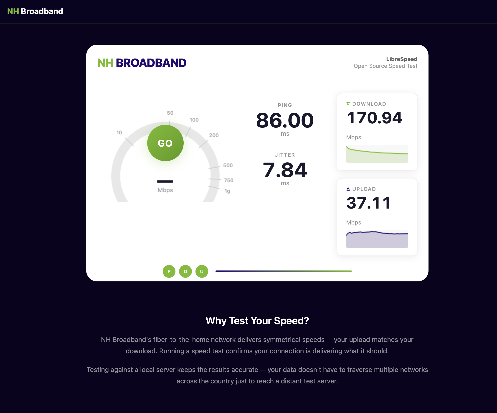

# LibreSpeed Custom UI — Ookla-Style Template

A clean, modern, Ookla Speedtest Custom-inspired frontend for [LibreSpeed](https://github.com/librespeed/speedtest). Drop-in replacement for the default `index.html`.



## Features

- **Auto-start** — test begins automatically on page load, no GO button
- **Ookla Custom-style results** — 3-column layout with ping/jitter, download/upload with throughput graphs, and AGAIN button
- **Live throughput visualization** — area charts showing speed over time during test
- **Responsive** — works on mobile and desktop
- **CSS variable theming** — change 2 color values to match your brand
- **HiDPI canvas** — crisp graphs on Retina/high-DPI displays
- **ISP detection** — shows client ISP name and IP via LibreSpeed's built-in GeoIP
- **Progress bar** — visual progress indicator with phase tracking
- **No external dependencies** — pure HTML/CSS/JS, no frameworks
- **Telemetry support** — works with LibreSpeed's built-in results logging

## Installation

1. Set up a standard LibreSpeed server ([instructions](https://github.com/librespeed/speedtest))
2. Replace the default `index.html` with the one from this repo
3. That's it — `speedtest.js` and the backend files remain unchanged

## Customization

### Colors

Edit the CSS variables at the top of `index.html`:

```css
:root {
    --primary: #1a73e8;      /* Download color, buttons, accents */
    --secondary: #7c3aed;    /* Upload color */
}
```

### Branding

Search for `CUSTOMIZE` comments in the HTML:

- **Brand name** — Update the `.brand` text in the header
- **Server name/location** — Update in the results view and footer

### Auto-start

The test auto-starts on page load. To add a GO button instead, remove the `window.addEventListener("load", ...)` call at the bottom of the script and add a button that calls `runTest()`.

### Embedding

This template works great as an iframe embed:

```html
<iframe src="https://your-speedtest-server.com/" 
        style="width:100%;height:460px;border:none;border-radius:16px;"
        allow="clipboard-write" loading="lazy"></iframe>
```

Set `overflow:hidden` on `html,body` (already set) to prevent scrollbars in the iframe.

## Requirements

- LibreSpeed server (PHP, Node.js, Go, or Rust backend)
- Modern browser (Chrome, Firefox, Safari, Edge)

## License

LGPL-3.0 — same as LibreSpeed.

## Credits

- [LibreSpeed](https://github.com/librespeed/speedtest) — the speed test engine
- UI design inspired by Ookla Speedtest Custom
- Created by [Hawthorn Consulting](https://hawthornconsulting.net)
